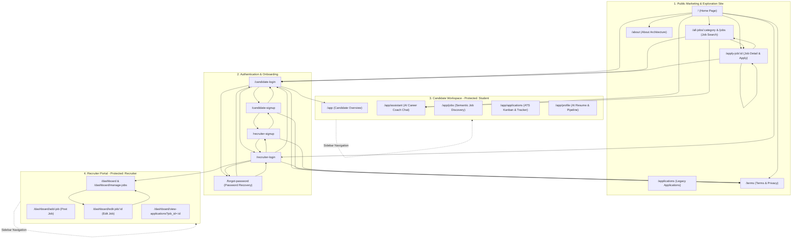
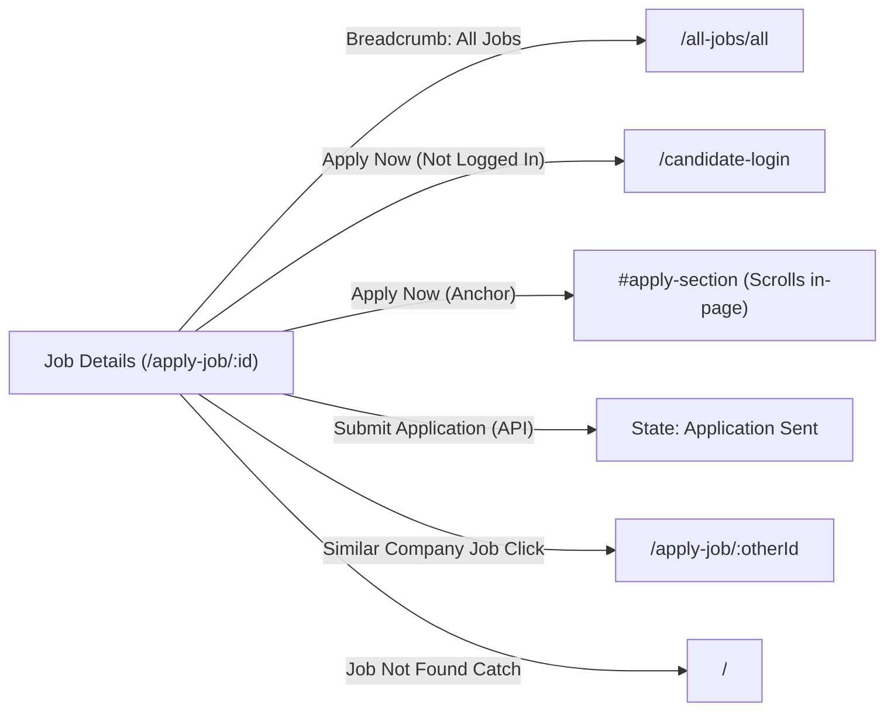
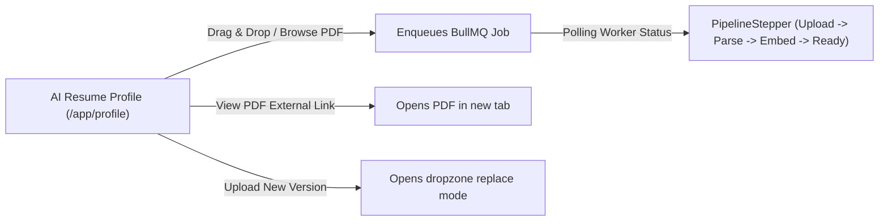
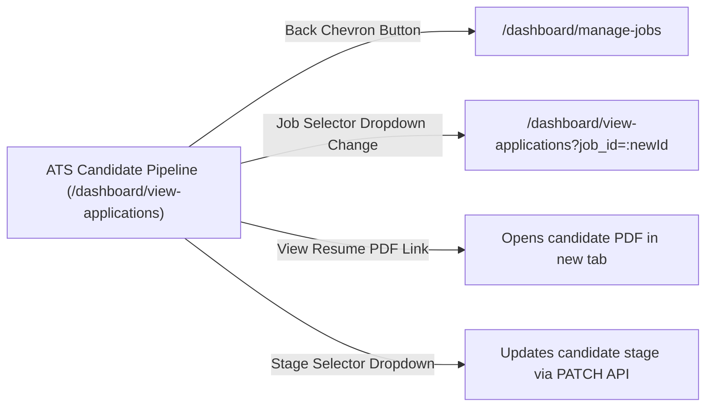

# CareerPilot Frontend Page Navigation & Dependency Analysis

A comprehensive technical analysis of the frontend architecture, page routing, interactive UI triggers, and cross-page navigation dependencies for the **CareerPilot** (AI-Based Internship & Job Recommendation) web application.

---

## 1. High-Level Routing & Architectural Zones

The frontend is built with **React Router DOM (`v7`/`v6`)** and structured into **three distinct functional zones** plus authentication flows:



---

## 2. Global Navigation Components

### 2.1 Public & Marketing Header (`Navbar.jsx`)
Rendered on all public routes (`/`, `/all-jobs/*`, `/jobs`, `/about`, `/terms`, `/apply-job/*`, `/applications`).

| UI Element / Trigger | Condition / State | Destination Route / Action | Description |
| :--- | :--- | :--- | :--- |
| **Brand Logo (`CP CareerPilot`)** | Any | `/` | Navigates to Home page |
| **Nav Link: "Home"** | Any | `/` | Navigates to Home page |
| **Nav Link: "All Jobs"** | Any | `/all-jobs/all` | Navigates to Job Catalog |
| **Nav Link: "About"** | Any | `/about` | Navigates to Architecture / About page |
| **"Employers" Link** | Guest (Logged Out) | `/recruiter-login` | Takes employer to login |
| **"Sign In" Button** | Guest (Logged Out) | `/candidate-login` | Candidate sign in |
| **"Sign Up" Button** | Guest (Logged Out) | `/candidate-signup` | Candidate registration |
| **"My Workspace" Button** | Logged In (`role === "student"`) | `/app` | Direct access to candidate workspace |
| **"Recruiter Portal" Button** | Logged In (`role === "recruiter"`) | `/dashboard/manage-jobs` | Direct access to employer portal |
| **Profile Menu -> Candidate Workspace** | Logged In (`role === "student"`) | `/app` | Profile dropdown link |
| **Profile Menu -> Recruiter Dashboard** | Logged In (`role === "recruiter"`) | `/dashboard/manage-jobs` | Profile dropdown link |
| **Profile Menu -> Sign Out** | Logged In (Any role) | `logout()` -> `/` or login | Clears token & auth context |
| **Mobile Drawer Links** | Mobile view | Same routes as above | Responsive mobile navigation |

---

### 2.2 Global Public Footer (`Footer.jsx`)
Rendered across all public pages at the bottom.

| UI Element / Trigger | Destination Route / Target | Description |
| :--- | :--- | :--- |
| **Logo (`CP CareerPilot`)** | `/` | Returns to Home page |
| **Platform -> "Find Jobs"** | `/all-jobs/all` | Navigates to public jobs directory |
| **Platform -> "About Architecture"** | `/about` | Navigates to About page |
| **Platform -> "AI Career Coach"** | `/candidate-login` | Direct candidate sign-in for AI Coach |
| **Platform -> "For Employers"** | `/recruiter-login` | Direct employer sign-in |
| **Legal -> "Terms of Service"** | `/terms` | Navigates to Terms & Conditions |
| **Legal -> "Privacy Policy"** | `/terms` | Navigates to Privacy section in Terms |
| **Support Email Link** | `mailto:support@careerpilot.ai` | Opens user's default email client |

---

### 2.3 Candidate App Chrome (`AppSidebar.jsx` & `AppTopbar.jsx`)
Persistent sidebar and topbar inside `/app/*` protected layout (`CandidateLayout.jsx`).

| UI Component | Element / Trigger | Destination Route | Action / State Passed |
| :--- | :--- | :--- | :--- |
| **AppSidebar** | Brand Logo | `/` | Back to marketing landing page |
| **AppSidebar** | Nav: "Overview" | `/app` | Candidate overview dashboard |
| **AppSidebar** | Nav: "AI Assistant" | `/app/assistant` | Real-time Socket.IO chat coach |
| **AppSidebar** | Nav: "Find Jobs" | `/app/jobs` | Semantic job discovery portal |
| **AppSidebar** | Nav: "Applications" | `/app/applications` | ATS Kanban board application tracker |
| **AppSidebar** | Nav: "Resume Profile" | `/app/profile` | AI Resume Dropzone & BullMQ pipeline |
| **AppSidebar** | Logout Button (`LogOut` icon) | `logout()` | Destroys token & session |
| **AppTopbar** | Search Bar Form Submit | `/app/jobs` | Sets `searchFilter.title` & `isSearched=true` |
| **AppTopbar** | Mobile Menu Hamburger | N/A | Opens mobile drawer with all 5 nav links |

---

### 2.4 Recruiter App Chrome (`RecruiterLayout.jsx`)
Persistent sidebar and topbar inside `/dashboard/*` protected layout.

| UI Component | Element / Trigger | Destination Route | Action / State Passed |
| :--- | :--- | :--- | :--- |
| **Recruiter Sidebar** | Brand Logo | `/` | Back to marketing landing page |
| **Recruiter Sidebar** | Nav: "Manage Postings" | `/dashboard/manage-jobs` | Company active job listings |
| **Recruiter Sidebar** | Nav: "Post a Job" | `/dashboard/add-job` | New job creator & vectorizer |
| **Recruiter Sidebar** | Nav: "View Applications" | `/dashboard/view-applications` | ATS candidate review pipeline |
| **Recruiter Sidebar** | Logout Button (`LogOut` icon) | `logout()` | Destroys recruiter session |
| **Recruiter Topbar** | "Post New Role" CTA | `/dashboard/add-job` | Direct shortcut to job creation |
| **Recruiter Topbar** | Mobile Hamburger | N/A | Opens responsive mobile drawer |

---

## 3. Page-by-Page Navigation Dependency Matrix

---

### Page 1: Home (`/`)
* **File:** [`Home.jsx`](file:///d:/ai%20based%20intership%20recommendation/AI-Based-Internship-Recommendation/frontend/src/pages/Home.jsx)
* **Layout:** `AppLayout` (`Navbar` + `Footer`)
* **Sub-Components:** `Hero`, `HowItWorks`, `AIChatTeaser`, `JobCategory`, `FeaturedJob`, `Testimonials`, `Counter`

```mermaid
flowchart LR
    HOME["Home Page (/)"]
    
    HOME -- Search Bar Submit --> ALL_JOBS["/all-jobs/all (with filter)"]
    HOME -- Job Category Cards --> ALL_JOBS_CAT["/all-jobs/:category"]
    HOME -- "Try free" / AI Prompts --> ASSISTANT["/app/assistant (or /candidate-login?next=...)"]
    HOME -- Job Card Click --> APPLY["/apply-job/:id"]
    HOME -- "Ask AI about Job" --> ASSISTANT
    HOME -- "Explore All Jobs" Button --> ALL_JOBS
    HOME -- Counter "Explore Opportunities" --> ALL_JOBS
```

#### Detailed Clickable Elements & Destinations:
1. **Hero Component (`Hero.jsx`)**:
   - **Search Form Submission**: Sets `searchFilter = { title, location }` and `isSearched = true` $\rightarrow$ navigates to `/all-jobs/all`.
2. **JobCategory Component (`JobCategory.jsx`)**:
   - **Category Cards (7 cards)**: Click on category item $\rightarrow$ navigates to `/all-jobs/${encodeURIComponent(name)}` with scroll to top `(0,0)`.
3. **AIChatTeaser Component (`AIChatTeaser.jsx`)**:
   - **Prompt Chips ("What jobs match my resume?", etc.)**:
     - *If Student:* navigates to `/app/assistant` with `state: { initialPrompt: chip }`.
     - *If Guest:* navigates to `/candidate-login?next=/app/assistant` with `state: { initialPrompt: chip }`.
   - **"Try free" CTA Button**:
     - *If Student:* navigates to `/app/assistant`.
     - *If Guest:* navigates to `/candidate-login?next=/app/assistant`.
4. **FeaturedJob Component (`FeaturedJob.jsx` & `JobCard.jsx`)**:
   - **Job Card Entire Click Area**: Navigates to `/apply-job/${job.id}`.
   - **"Apply Now" Button**: Navigates to `/apply-job/${job.id}`.
   - **"Ask AI about Job" Button**: Navigates to `/app/assistant` with prompt state: `Tell me about the requirements for the "${job.title}" position at "${company}"...`.
   - **"Explore All Jobs" CTA Button**: Navigates to `/all-jobs/all`.
5. **Counter Component (`Counter.jsx`)**:
   - **"Explore Opportunities" Button**: Navigates to `/all-jobs/all`.

---

### Page 2: All Jobs Catalog (`/all-jobs/:category` and `/jobs`)
* **File:** [`AllJobs.jsx`](file:///d:/ai%20based%20intership%20recommendation/AI-Based-Internship-Recommendation/frontend/src/pages/AllJobs.jsx)
* **Layout:** `AppLayout` (`Navbar` + `Footer`)
* **Protection:** Public (Special AI Recommendation Rail shown if student is logged in)

```mermaid
flowchart LR
    ALL_JOBS["All Jobs (/all-jobs/:category)"]

    ALL_JOBS -- "Clear All Filters" --> RESET["/all-jobs/all"]
    ALL_JOBS -- Recommended Job Card Click --> APPLY["/apply-job/:id"]
    ALL_JOBS -- Grid Job Card "Apply Now" --> APPLY
    ALL_JOBS -- Grid Job Card "Ask AI" --> ASSISTANT["/app/assistant"]
    ALL_JOBS -- Pagination Prev/Next/Page Numbers --> PAGE["Page State Change (1..N)"]
```

#### Detailed Clickable Elements & Destinations:
1. **"For You" AI Recommended Jobs (if logged in as student)**:
   - Click recommended card $\rightarrow$ navigates to `/apply-job/${job.id}`.
2. **Job Cards Grid (`JobCard.jsx`)**:
   - Entire Card Click $\rightarrow$ `/apply-job/${job.id}`.
   - "Apply Now" Button $\rightarrow$ `/apply-job/${job.id}`.
   - "Ask AI about Job" Button $\rightarrow$ `/app/assistant` with customized initial prompt in router state.
3. **Filter Sidebar**:
   - "Clear All Filters" $\rightarrow$ resets search inputs & navigates to `/all-jobs/all`.
4. **Empty State**:
   - "Clear Filters" button $\rightarrow$ resets search inputs & navigates to `/all-jobs/all`.
5. **Pagination**:
   - Numbered Buttons / Prev / Next $\rightarrow$ updates `currentPage` state in-place.

---

### Page 3: Apply Job / Job Details (`/apply-job/:id`)
* **File:** [`ApplyJob.jsx`](file:///d:/ai%20based%20intership%20recommendation/AI-Based-Internship-Recommendation/frontend/src/pages/ApplyJob.jsx)
* **Layout:** `AppLayout` (`Navbar` + `Footer`)
* **Protection:** Public view; application submission requires Candidate role



#### Detailed Clickable Elements & Destinations:
1. **Breadcrumb Navigation**:
   - "All Jobs" link $\rightarrow$ navigates to `/all-jobs/all`.
2. **Header CTA**:
   - If not applied: anchor `<a href="#apply-section">` $\rightarrow$ scrolls down to application form.
   - If already applied: disabled button showing "Application Sent".
3. **Submit Application Action (`applyJobHandler`)**:
   - *If Guest:* displays error toast and navigates to `/candidate-login`.
   - *If Student:* submits `POST /applications` with cover letter $\rightarrow$ marks application as sent and refreshes application context.
4. **Similar Company Jobs Sidebar Rail**:
   - Clicking any similar job card $\rightarrow$ navigates to `/apply-job/${job.id}` and scrolls to `(0,0)`.
5. **Fallback on Error**:
   - If invalid job ID / API 404 $\rightarrow$ automatically navigates to `/`.

---

### Page 4: Legacy Applications Page (`/applications`)
* **File:** [`Applications.jsx`](file:///d:/ai%20based%20intership%20recommendation/AI-Based-Internship-Recommendation/frontend/src/pages/Applications.jsx)
* **Layout:** `AppLayout` (`Navbar` + `Footer`)
* **Protection:** Student / Candidate Account

#### Detailed Clickable Elements & Destinations:
1. **Resume Dropzone / Upload Box**:
   - Click on dashed area $\rightarrow$ opens native OS file picker (`#resume-upload`).
   - "Upload & Parse" Button $\rightarrow$ executes `POST /ai/resume/upload` and updates profile in-place.
   - "Update" Button $\rightarrow$ toggles `isEdit = true`.
   - "Cancel" Button $\rightarrow$ exits edit mode.
2. **"View PDF" Button**:
   - Opens the uploaded resume PDF in a new browser tab (`target="_blank"`).
3. **Application History Table**:
   - Displays all historical submissions, company icons, applied dates, and statuses (`applied`, `shortlisted`, `rejected`, etc.).

---

### Page 5: About Architecture (`/about`)
* **File:** [`About.jsx`](file:///d:/ai%20based%20intership%20recommendation/AI-Based-Internship-Recommendation/frontend/src/pages/About.jsx)
* **Layout:** `AppLayout` (`Navbar` + `Footer`)

#### Detailed Clickable Elements & Destinations:
1. **Counter Component**:
   - "Explore Opportunities" button $\rightarrow$ navigates to `/all-jobs/all`.
2. **Testimonials Carousel**:
   - Swiper pagination bullets and swipe interaction.

---

### Page 6: Terms and Conditions (`/terms`)
* **File:** [`Terms.jsx`](file:///d:/ai%20based%20intership%20recommendation/AI-Based-Internship-Recommendation/frontend/src/pages/Terms.jsx)
* **Layout:** `AppLayout` (`Navbar` + `Footer`)

#### Detailed Clickable Elements & Destinations:
1. **FAQ Cards & Legal Clauses**: Informational content with Accordion / Slide-in views.
2. **Navbar & Footer links**: Standard cross-site navigation.

---

### Page 7: Candidate Login (`/candidate-login`)
* **File:** [`CandidatesLogin.jsx`](file:///d:/ai%20based%20intership%20recommendation/AI-Based-Internship-Recommendation/frontend/src/pages/CandidatesLogin.jsx)
* **Layout:** `AuthLayout.jsx`

```mermaid
flowchart LR
    CLOGIN["Candidate Login (/candidate-login)"]

    CLOGIN -- "Back to Home" --> HOME["/"]
    CLOGIN -- Role Switch Tab: "I am an Employer" --> RLOGIN["/recruiter-login?next=..."]
    CLOGIN -- Successful Sign In --> TARGET["/app (or next URL)"]
    CLOGIN -- "Sign up" Link --> CSIGNUP["/candidate-signup?next=..."]
```

#### Detailed Clickable Elements & Destinations:
1. **AuthLayout Header**:
   - Brand logo $\rightarrow$ `/`.
   - "Back to Home" button $\rightarrow$ `/`.
2. **Role Switcher Tabs**:
   - "I am an Employer" tab $\rightarrow$ navigates to `/recruiter-login?next=${nextParam}` (preserves redirect parameter).
3. **Login Form Submission (`userLoginHandler`)**:
   - Calls `POST /auth/login/student`.
   - Upon success: stores JWT token $\rightarrow$ redirects to `nextParam` (e.g. `/app/assistant`, `/app/jobs`) or default `/app`.
4. **"Sign up" Link**:
   - Navigates to `/candidate-signup?next=${nextParam}`.

---

### Page 8: Candidate Signup (`/candidate-signup`)
* **File:** [`CandidatesSignup.jsx`](file:///d:/ai%20based%20intership%20recommendation/AI-Based-Internship-Recommendation/frontend/src/pages/CandidatesSignup.jsx)
* **Layout:** `AuthLayout.jsx`

#### Detailed Clickable Elements & Destinations:
1. **Role Switcher Tabs**:
   - "I am an Employer" tab $\rightarrow$ navigates to `/recruiter-signup?next=${nextParam}`.
2. **Legal Agreement Links**:
   - "Terms of Service" $\rightarrow$ `/terms`.
   - "Privacy Policy" $\rightarrow$ `/terms`.
3. **Form Submission (`userSignupHandler`)**:
   - Calls `POST /auth/register/student`.
   - Upon success: displays toast $\rightarrow$ redirects to `/candidate-login?next=${nextParam}`.
4. **"Sign in" Link**:
   - Navigates to `/candidate-login?next=${nextParam}`.

---

### Page 9: Recruiter Login (`/recruiter-login`)
* **File:** [`RecruiterLogin.jsx`](file:///d:/ai%20based%20intership%20recommendation/AI-Based-Internship-Recommendation/frontend/src/pages/RecruiterLogin.jsx)
* **Layout:** `AuthLayout.jsx`

```mermaid
flowchart LR
    RLOGIN["Employer Login (/recruiter-login)"]

    RLOGIN -- "Back to Home" --> HOME["/"]
    RLOGIN -- Role Switch Tab: "I am a Candidate" --> CLOGIN["/candidate-login?next=..."]
    RLOGIN -- Successful Sign In --> DASH["/dashboard/manage-jobs (or next URL)"]
    RLOGIN -- "Register company" Link --> RSIGNUP["/recruiter-signup?next=..."]
```

#### Detailed Clickable Elements & Destinations:
1. **Role Switcher Tabs**:
   - "I am a Candidate" tab $\rightarrow$ navigates to `/candidate-login?next=${nextParam}`.
2. **Form Submission (`recruiterLoginHandler`)**:
   - Calls `POST /auth/login/recruiter`.
   - Upon success: stores JWT token $\rightarrow$ redirects to `nextParam` or `/dashboard/manage-jobs`.
3. **"Register company" Link**:
   - Navigates to `/recruiter-signup?next=${nextParam}`.

---

### Page 10: Recruiter Signup (`/recruiter-signup`)
* **File:** [`RecruiterSignup.jsx`](file:///d:/ai%20based%20intership%20recommendation/AI-Based-Internship-Recommendation/frontend/src/pages/RecruiterSignup.jsx)
* **Layout:** `AuthLayout.jsx`

#### Detailed Clickable Elements & Destinations:
1. **Role Switcher Tabs**:
   - "I am a Candidate" tab $\rightarrow$ navigates to `/candidate-signup?next=${nextParam}`.
2. **Terms Links**:
   - "Employer Terms" $\rightarrow$ `/terms`.
   - "Privacy Policy" $\rightarrow$ `/terms`.
3. **Form Submission (`recruiterSignupHandler`)**:
   - Calls `POST /auth/register/recruiter`.
   - Upon success: displays toast $\rightarrow$ redirects to `/recruiter-login?next=${nextParam}`.
4. **"Sign in" Link**:
   - Navigates to `/recruiter-login?next=${nextParam}`.

---

### Page 11: Candidate Overview (`/app`)
* **File:** [`Overview.jsx`](file:///d:/ai%20based%20intership%20recommendation/AI-Based-Internship-Recommendation/frontend/src/pages/app/Overview.jsx)
* **Layout:** `CandidateLayout.jsx` (`AppSidebar` + `AppTopbar`)
* **Protection:** `ProtectedRoute (role="student")`

```mermaid
flowchart LR
    OVERVIEW["Candidate Overview (/app)"]

    OVERVIEW -- "Update Resume" Link --> PROFILE["/app/profile"]
    OVERVIEW -- "Total Applications" Metric Card --> APPS["/app/applications"]
    OVERVIEW -- "Semantic Matches" Metric Card --> JOBS["/app/jobs"]
    OVERVIEW -- "AI Career Coach" Metric Card --> ASSISTANT["/app/assistant"]
    OVERVIEW -- "View all matching jobs" Link --> JOBS
    OVERVIEW -- Job Card Click --> APPLY["/apply-job/:id"]
    OVERVIEW -- Job Card "Ask AI" --> ASSISTANT
    OVERVIEW -- Quick Prompt Bar Submit --> ASSISTANT
```

#### Detailed Clickable Elements & Destinations:
1. **Completeness Meter**:
   - "Update Resume" link $\rightarrow$ navigates to `/app/profile`.
2. **Metric Snapshot Cards (3 Cards)**:
   - "Total Applications" Card $\rightarrow$ navigates to `/app/applications`.
   - "Semantic Matches" Card $\rightarrow$ navigates to `/app/jobs`.
   - "AI Career Coach" Card $\rightarrow$ navigates to `/app/assistant`.
3. **Top Recommendations Header**:
   - "View all matching jobs" link $\rightarrow$ navigates to `/app/jobs`.
4. **Job Cards (Top 3)**:
   - Entire Card / "Apply Now" $\rightarrow$ navigates to `/apply-job/${job.id}`.
   - "Ask AI about Job" $\rightarrow$ navigates to `/app/assistant` with initial prompt state.
5. **Quick AI Prompt Bar Form**:
   - Submitting prompt text $\rightarrow$ navigates to `/app/assistant` with `state: { initialPrompt: quickPrompt }`.

---

### Page 12: AI Assistant Career Coach (`/app/assistant`)
* **File:** [`Assistant.jsx`](file:///d:/ai%20based%20intership%20recommendation/AI-Based-Internship-Recommendation/frontend/src/pages/app/Assistant.jsx)
* **Layout:** `CandidateLayout.jsx`
* **Protection:** `ProtectedRoute (role="student")`

```mermaid
flowchart LR
    ASSISTANT["AI Assistant (/app/assistant)"]

    ASSISTANT -- "Reset" Button --> RESET["Clears local messages state"]
    ASSISTANT -- Prompt Chips / Form Submit --> STREAM["Socket.IO Streaming Response"]
    ASSISTANT -- Resume Rail "Edit Profile" Icon --> PROFILE["/app/profile"]
    ASSISTANT -- Resume Rail "Upload Resume" CTA --> PROFILE
    ASSISTANT -- Resume Rail "Update" Link --> PROFILE
```

#### Detailed Clickable Elements & Destinations:
1. **Chat Header**:
   - "Reset" Button $\rightarrow$ resets active conversation to greeting message.
2. **Message Stream**:
   - "Copy" icon on AI messages $\rightarrow$ copies text to OS clipboard.
3. **Quick Suggestion Prompt Chips**:
   - Clicking chip $\rightarrow$ populates and sends prompt over `socket.io` websocket.
4. **Message Input Form**:
   - Submitting message $\rightarrow$ streams response token-by-token.
5. **Resume Context Rail (`ResumeContextRail.jsx`)**:
   - External Link icon $\rightarrow$ navigates to `/app/profile`.
   - "Upload Resume" button (when empty) $\rightarrow$ navigates to `/app/profile`.
   - "Update" link $\rightarrow$ navigates to `/app/profile`.

---

### Page 13: Candidate Semantic Job Discovery (`/app/jobs`)
* **File:** [`Jobs.jsx`](file:///d:/ai%20based%20intership%20recommendation/AI-Based-Internship-Recommendation/frontend/src/pages/app/Jobs.jsx)
* **Layout:** `CandidateLayout.jsx`
* **Protection:** `ProtectedRoute (role="student")`

```mermaid
flowchart LR
    APP_JOBS["Candidate Jobs (/app/jobs)"]

    APP_JOBS -- Recommended Rail Card Click --> APPLY["/apply-job/:id"]
    APP_JOBS -- Job Card "Apply Now" --> APPLY
    APP_JOBS -- Job Card "Ask AI" --> ASSISTANT["/app/assistant"]
    APP_JOBS -- Filter Reset Button --> RESET["Clears filters in-place"]
    APP_JOBS -- Mobile Filters Toggle --> MODAL["Toggles mobile filter panel"]
```

#### Detailed Clickable Elements & Destinations:
1. **Recommended Rail (`RecommendedRail.jsx`)**:
   - Top 3 FAISS Matched Cards $\rightarrow$ clicking any card navigates to `/apply-job/${job.id}`.
2. **Filter Controls (`JobFilters.jsx`)**:
   - "Reset" button $\rightarrow$ resets categories, locations, role types, and search queries.
   - Category checkboxes / Location checkboxes / Role type radios $\rightarrow$ filter job feed in-place.
3. **Job Cards Grid (`JobCard.jsx`)**:
   - Card click $\rightarrow$ navigates to `/apply-job/${job.id}`.
   - "Apply Now" $\rightarrow$ navigates to `/apply-job/${job.id}`.
   - "Ask AI about Job" $\rightarrow$ navigates to `/app/assistant` with custom prompt state.
4. **Mobile Filter Button**:
   - Toggles visibility of the filter sidebar on mobile screens.

---

### Page 14: Candidate Applications Kanban & Tracker (`/app/applications`)
* **File:** [`ApplicationsKanban.jsx`](file:///d:/ai%20based%20intership%20recommendation/AI-Based-Internship-Recommendation/frontend/src/pages/app/ApplicationsKanban.jsx)
* **Layout:** `CandidateLayout.jsx`
* **Protection:** `ProtectedRoute (role="student")`

```mermaid
flowchart LR
    KANBAN["Applications Kanban (/app/applications)"]

    KANBAN -- View Toggle: "Kanban Board" --> VIEW_K["Kanban 4-Column Board"]
    KANBAN -- View Toggle: "Table View" --> VIEW_T["Detailed Table View"]
    KANBAN -- Empty State: "Explore Matching Jobs" --> APP_JOBS["/app/jobs"]
    KANBAN -- Card / Row Click --> MODAL["Application Detail Modal"]
    MODAL -- "View Full Job Spec" --> APPLY["/apply-job/:id"]
    MODAL -- "Close" Button --> CLOSE["Dismisses modal"]
```

#### Detailed Clickable Elements & Destinations:
1. **View Switcher Pill**:
   - "Kanban Board" button $\rightarrow$ toggles 4-column drag/card view (`Applied`, `Shortlisted`, `Interviewing`, `Selected`).
   - "Table View" button $\rightarrow$ toggles data table with AI match gauges and dates.
2. **Role Type Filter Dropdown**:
   - Filters between All, Internships, Full Time, Contract in-place.
3. **Kanban Cards (`ApplicationCard.jsx`) & Table Rows**:
   - Clicking any application $\rightarrow$ opens the **Application Details Modal** with match breakdown and cover letter.
4. **Application Details Modal**:
   - "View Full Job Spec" button $\rightarrow$ navigates to `/apply-job/${selectedApp.job.id}`.
   - Close / X button $\rightarrow$ dismisses modal.
5. **Empty State Button**:
   - "Explore Matching Jobs" $\rightarrow$ navigates to `/app/jobs`.

---

### Page 15: Candidate Resume Profile & Pipeline (`/app/profile`)
* **File:** [`Profile.jsx`](file:///d:/ai%20based%20intership%20recommendation/AI-Based-Internship-Recommendation/frontend/src/pages/app/Profile.jsx)
* **Layout:** `CandidateLayout.jsx`
* **Protection:** `ProtectedRoute (role="student")`
* **Sub-Components:** `PipelineStepper.jsx`, `ResumeDropzone.jsx`, `AIProfileCard.jsx`



#### Detailed Clickable Elements & Destinations:
1. **Resume Dropzone (`ResumeDropzone.jsx`)**:
   - Drag & Drop zone / "Browse Files" $\rightarrow$ opens native file picker.
   - "Process with AI" / "Upload & Parse" $\rightarrow$ triggers `POST /ai/resume/upload` and initiates BullMQ async task polling (`/ai/resume/status/:taskId`).
   - "Upload New Version / Replace Resume" $\rightarrow$ reveals dropzone input.
   - "Cancel" $\rightarrow$ exits replace mode.
   - "View PDF" External Link $\rightarrow$ opens raw resume file in a new browser tab.
2. **Pipeline Stepper (`PipelineStepper.jsx`)**:
   - Visual indicator showing progress through 4 pipeline stages (`Upload`, `Queue Parsing`, `FAISS Embedding`, `Context Ready`).
3. **AI Profile Card (`AIProfileCard.jsx`)**:
   - Interactive badge displays for extracted skill vectors, work experience, and educational background.

---

### Page 16: Recruiter Manage Postings (`/dashboard` & `/dashboard/manage-jobs`)
* **File:** [`ManageJobs.jsx`](file:///d:/ai%20based%20intership%20recommendation/AI-Based-Internship-Recommendation/frontend/src/pages/ManageJobs.jsx)
* **Layout:** `RecruiterLayout.jsx`
* **Protection:** `ProtectedRoute (role="recruiter")`

```mermaid
flowchart LR
    MANAGE["Manage Jobs (/dashboard/manage-jobs)"]

    MANAGE -- "Post New Job" CTA --> ADD_JOB["/dashboard/add-job"]
    MANAGE -- "Applicants Review" Badge --> VIEW_APPS["/dashboard/view-applications?job_id=:id"]
    MANAGE -- "View ATS Board ->" Link --> VIEW_APPS
    MANAGE -- "Active/Closed" Status Toggle --> TOGGLE["Updates job status via API"]
    MANAGE -- Empty State: "Post a Job" --> ADD_JOB
```

#### Detailed Clickable Elements & Destinations:
1. **Header "Post New Job" Button**:
   - Navigates to `/dashboard/add-job`.
2. **Empty State "Post a Job" Button**:
   - Navigates to `/dashboard/add-job`.
3. **Applicants Count Badge (`Users` icon)**:
   - Navigates to `/dashboard/view-applications?job_id=${job.id}`.
4. **"View ATS Board $\rightarrow$" Action Link**:
   - Navigates to `/dashboard/view-applications?job_id=${job.id}`.
5. **Status Pill ("Active" / "Closed")**:
   - Toggles job status via `PUT /recruiter/jobs/:jobId` in-place.

---

### Page 17: Recruiter Post a Job (`/dashboard/add-job`)
* **File:** [`AddJobs.jsx`](file:///d:/ai%20based%20intership%20recommendation/AI-Based-Internship-Recommendation/frontend/src/pages/AddJobs.jsx)
* **Layout:** `RecruiterLayout.jsx`
* **Protection:** `ProtectedRoute (role="recruiter")`

```mermaid
flowchart LR
    ADD_JOB["Post a Job (/dashboard/add-job)"]

    ADD_JOB -- Form Submit: "Publish Job Posting" --> MANAGE["/dashboard/manage-jobs"]
    ADD_JOB -- "Cancel" Button --> MANAGE
```

#### Detailed Clickable Elements & Destinations:
1. **Job Form Submission (`postJob`)**:
   - Calls `POST /recruiter/jobs` (vectorizes job into FAISS) $\rightarrow$ upon success: toast notification & navigates to `/dashboard/manage-jobs`.
2. **"Cancel" Button**:
   - Navigates to `/dashboard/manage-jobs`.
3. **Rich Text Quill Editor**:
   - Formats description, bullets, headers in-place.
4. **Remote Toggle**:
   - Toggles location input visibility.

---

### Page 18: Recruiter View Applications & ATS (`/dashboard/view-applications`)
* **File:** [`ViewApplications.jsx`](file:///d:/ai%20based%20intership%20recommendation/AI-Based-Internship-Recommendation/frontend/src/pages/ViewApplications.jsx)
* **Layout:** `RecruiterLayout.jsx`
* **Protection:** `ProtectedRoute (role="recruiter")`



#### Detailed Clickable Elements & Destinations:
1. **Back Chevron Button (`ChevronLeft`)**:
   - Navigates to `/dashboard/manage-jobs`.
2. **Job Filter Dropdown**:
   - Changing selection $\rightarrow$ navigates to `/dashboard/view-applications?job_id=${selectedId}` and reloads candidate list.
3. **"View Resume PDF" Button**:
   - Opens candidate's resume PDF in a new tab (`target="_blank"`).
4. **Stage / Decision Selector Dropdown**:
   - Changing status (`applied`, `shortlisted`, `interviewing`, `selected`, `rejected`) $\rightarrow$ executes `PATCH /recruiter/applications/:id/status` in-place.

---

## 4. Master Cross-Page Navigation Dependency Table

| Source Page / Route | Interactive UI Trigger | Destination Route / Target | State / Parameters Passed |
| :--- | :--- | :--- | :--- |
| **Navbar** (Any public page) | Logo / "Home" | `/` | None |
| **Navbar** (Any public page) | "All Jobs" | `/all-jobs/all` | None |
| **Navbar** (Any public page) | "About" | `/about` | None |
| **Navbar** (Any public page) | "Employers" | `/recruiter-login` | None |
| **Navbar** (Any public page) | "Sign in" | `/candidate-login` | None |
| **Navbar** (Any public page) | "Sign up" | `/candidate-signup` | None |
| **Navbar** (Student logged in) | "My Workspace" / Dropdown | `/app` | None |
| **Navbar** (Recruiter logged in) | "Recruiter Portal" / Dropdown | `/dashboard/manage-jobs` | None |
| **Navbar** (Any logged in user) | "Sign Out" | Session Cleared | None |
| **Footer** (Any public page) | "Find Jobs" | `/all-jobs/all` | None |
| **Footer** (Any public page) | "About Architecture" | `/about` | None |
| **Footer** (Any public page) | "AI Career Coach" | `/candidate-login` | None |
| **Footer** (Any public page) | "For Employers" | `/recruiter-login` | None |
| **Footer** (Any public page) | "Terms of Service" / "Privacy" | `/terms` | None |
| **Footer** (Any public page) | "support@careerpilot.ai" | `mailto:support@careerpilot.ai` | None |
| **Home (`/`)** | Hero Search Form Submit | `/all-jobs/all` | Context: `searchFilter={title, location}`, `isSearched=true` |
| **Home (`/`)** | Job Category Tile Click | `/all-jobs/:category` | Route param: `:category` (encoded name) |
| **Home (`/`)** | AI Teaser Prompt Chip | `/app/assistant` (Student)<br>`/candidate-login?next=/app/assistant` (Guest) | Router state: `{ initialPrompt: chipText }` |
| **Home (`/`)** | AI Teaser "Try free" | `/app/assistant` (Student)<br>`/candidate-login?next=/app/assistant` (Guest) | None |
| **Home (`/`)** | Featured Job Card / "Apply Now" | `/apply-job/:id` | Route param: `:id` |
| **Home (`/`)** | Featured Job "Ask AI about Job" | `/app/assistant` | Router state: `{ initialPrompt: promptText }` |
| **Home (`/`)** | Featured Job "Explore All Jobs" | `/all-jobs/all` | None |
| **Home (`/`)** | Counter "Explore Opportunities" | `/all-jobs/all` | None |
| **All Jobs (`/all-jobs/:cat`)** | "For You" Recommended Card | `/apply-job/:id` | Route param: `:id` |
| **All Jobs (`/all-jobs/:cat`)** | Job Card / "Apply Now" | `/apply-job/:id` | Route param: `:id` |
| **All Jobs (`/all-jobs/:cat`)** | Job Card "Ask AI about Job" | `/app/assistant` | Router state: `{ initialPrompt: promptText }` |
| **All Jobs (`/all-jobs/:cat`)** | "Clear All Filters" | `/all-jobs/all` | None |
| **Apply Job (`/apply-job/:id`)** | Breadcrumb "All Jobs" | `/all-jobs/all` | None |
| **Apply Job (`/apply-job/:id`)** | Apply (When not logged in) | `/candidate-login` | None |
| **Apply Job (`/apply-job/:id`)** | Similar Job Card in Sidebar | `/apply-job/:id` | Route param: `:id` (new job ID) |
| **Applications (`/applications`)** | "View PDF" Link | External URL / Backend Proxy | Opens PDF in new browser tab |
| **About (`/about`)** | "Explore Opportunities" | `/all-jobs/all` | None |
| **Candidate Login (`/candidate-login`)** | "I am an Employer" Tab | `/recruiter-login?next=...` | Preserves `?next` query param |
| **Candidate Login (`/candidate-login`)** | "Sign up" Link | `/candidate-signup?next=...` | Preserves `?next` query param |
| **Candidate Login (`/candidate-login`)** | Successful Sign In | `/app` or `nextParam` | Auth state token updated |
| **Candidate Login (`/candidate-login`)** | "Back to Home" | `/` | None |
| **Candidate Signup (`/candidate-signup`)** | "I am an Employer" Tab | `/recruiter-signup?next=...` | Preserves `?next` query param |
| **Candidate Signup (`/candidate-signup`)** | Terms / Privacy Link | `/terms` | None |
| **Candidate Signup (`/candidate-signup`)** | Successful Sign Up / "Sign in" | `/candidate-login?next=...` | Preserves `?next` query param |
| **Recruiter Login (`/recruiter-login`)** | "I am a Candidate" Tab | `/candidate-login?next=...` | Preserves `?next` query param |
| **Recruiter Login (`/recruiter-login`)** | "Register company" Link | `/recruiter-signup?next=...` | Preserves `?next` query param |
| **Recruiter Login (`/recruiter-login`)** | Successful Sign In | `/dashboard/manage-jobs` or `nextParam` | Recruiter auth token updated |
| **Recruiter Signup (`/recruiter-signup`)** | "I am a Candidate" Tab | `/candidate-signup?next=...` | Preserves `?next` query param |
| **Recruiter Signup (`/recruiter-signup`)** | Employer Terms / Privacy | `/terms` | None |
| **Recruiter Signup (`/recruiter-signup`)** | Successful Registration | `/recruiter-login?next=...` | Preserves `?next` query param |
| **AppSidebar** (Candidate) | "Overview" Nav | `/app` | None |
| **AppSidebar** (Candidate) | "AI Assistant" Nav | `/app/assistant` | None |
| **AppSidebar** (Candidate) | "Find Jobs" Nav | `/app/jobs` | None |
| **AppSidebar** (Candidate) | "Applications" Nav | `/app/applications` | None |
| **AppSidebar** (Candidate) | "Resume Profile" Nav | `/app/profile` | None |
| **AppSidebar** (Candidate) | Logout Icon | Session Cleared | Destroys token |
| **AppTopbar** (Candidate) | Search Form Submit | `/app/jobs` | Context: `searchFilter.title`, `isSearched=true` |
| **Candidate Overview (`/app`)** | "Update Resume" / Meter | `/app/profile` | None |
| **Candidate Overview (`/app`)** | Total Applications Card | `/app/applications` | None |
| **Candidate Overview (`/app`)** | Semantic Matches Card | `/app/jobs` | None |
| **Candidate Overview (`/app`)** | AI Career Coach Card | `/app/assistant` | None |
| **Candidate Overview (`/app`)** | "View all matching jobs" | `/app/jobs` | None |
| **Candidate Overview (`/app`)** | Recommended Job Card / Apply | `/apply-job/:id` | Route param: `:id` |
| **Candidate Overview (`/app`)** | Job Card "Ask AI" | `/app/assistant` | Router state: `{ initialPrompt: promptText }` |
| **Candidate Overview (`/app`)** | Quick Prompt Bar Submit | `/app/assistant` | Router state: `{ initialPrompt: quickPrompt }` |
| **AI Assistant (`/app/assistant`)** | Resume Rail "Edit Profile" / "Update" | `/app/profile` | None |
| **AI Assistant (`/app/assistant`)** | Resume Rail "Upload Resume" | `/app/profile` | None |
| **Candidate Jobs (`/app/jobs`)** | Recommended Rail Card | `/apply-job/:id` | Route param: `:id` |
| **Candidate Jobs (`/app/jobs`)** | Job Card / "Apply Now" | `/apply-job/:id` | Route param: `:id` |
| **Candidate Jobs (`/app/jobs`)** | Job Card "Ask AI about Job" | `/app/assistant` | Router state: `{ initialPrompt: promptText }` |
| **Applications Kanban (`/app/applications`)** | "Explore Matching Jobs" | `/app/jobs` | None |
| **Applications Kanban (`/app/applications`)** | Modal "View Full Job Spec" | `/apply-job/:id` | Route param: `:id` |
| **Candidate Profile (`/app/profile`)** | "View PDF" External Link | External URL / Backend Proxy | Opens PDF in new tab |
| **Recruiter Layout** | "Manage Postings" Nav | `/dashboard/manage-jobs` | None |
| **Recruiter Layout** | "Post a Job" Nav / Topbar CTA | `/dashboard/add-job` | None |
| **Recruiter Layout** | "View Applications" Nav | `/dashboard/view-applications` | None |
| **Recruiter Layout** | Logout Icon | Session Cleared | Destroys token |
| **Manage Jobs (`/dashboard/manage-jobs`)** | "Post New Job" / Empty State | `/dashboard/add-job` | None |
| **Manage Jobs (`/dashboard/manage-jobs`)** | Applicants Review Badge | `/dashboard/view-applications?job_id=:id` | Query param: `job_id` |
| **Manage Jobs (`/dashboard/manage-jobs`)** | "View ATS Board $\rightarrow$" Link | `/dashboard/view-applications?job_id=:id` | Query param: `job_id` |
| **Post a Job (`/dashboard/add-job`)** | Form Submit / "Cancel" | `/dashboard/manage-jobs` | None |
| **View Applications (`/dashboard/view-applications`)** | Back Chevron Button | `/dashboard/manage-jobs` | None |
| **View Applications (`/dashboard/view-applications`)** | Job Selector Dropdown | `/dashboard/view-applications?job_id=:newId` | Query param: `job_id` |
| **View Applications (`/dashboard/view-applications`)** | "View Resume PDF" Link | External URL / Backend Proxy | Opens candidate PDF in new tab |

---

## 5. Key State & Query Parameter Flow

### 1. `initialPrompt` (Router State)
Passed via `navigate(path, { state: { initialPrompt } })`:
- **Sources:**
  - `Hero.jsx` (Natural language search query)
  - `AIChatTeaser.jsx` (3 pre-defined suggestion chips)
  - `JobCard.jsx` ("Ask AI about Job" button with tailored company & title context)
  - `Overview.jsx` (Bottom quick prompt input bar)
- **Destination:**
  - `Assistant.jsx` checks `location.state?.initialPrompt` on mount, automatically injects and fires the prompt into the `Socket.IO` stream, and clears the history state.

### 2. `next` (URL Query Parameter)
Passed via `?next=${encodeURIComponent(targetPath)}`:
- **Sources:**
  - `ApplyJob.jsx` (When guest tries to apply)
  - `AIChatTeaser.jsx` (When guest clicks prompt chip or "Try free")
  - `AuthLayout.jsx` (Preserved when toggling between Candidate and Recruiter tabs)
- **Destinations:**
  - `CandidatesLogin.jsx` & `RecruiterLogin.jsx` read `searchParams.get("next")` to redirect the user directly back to their intended target upon successful authentication.

### 3. `job_id` (URL Query Parameter)
Passed via `?job_id=${job.id}`:
- **Sources:**
  - `ManageJobs.jsx` (Review applicants badge & "View ATS Board" links)
  - `ViewApplications.jsx` (Job selection dropdown)
- **Destinations:**
  - `ViewApplications.jsx` uses `searchParams.get("job_id")` to load and display ranked candidates for that specific job posting.

---
*Analysis generated for CareerPilot Frontend Application.*
