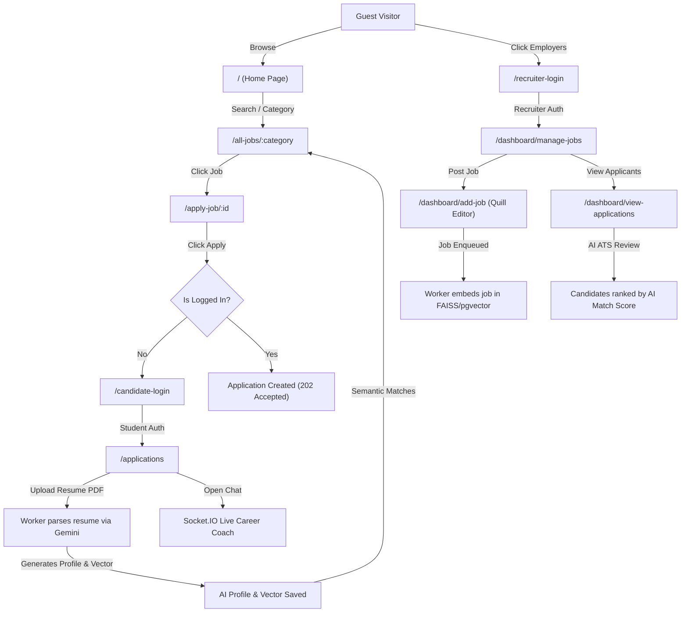

# CareerPilot — Frontend Architecture & UI/UX Specification

> **Platform:** CareerPilot (AI-Powered Smart Recruitment & Internship Matching Platform)  
> **Tech Stack:** React 19, Vite, Tailwind CSS v4, Framer Motion, Socket.IO Client, Lucide Icons, Axios, React Router v7  
> **Document Version:** 1.0.0 — Comprehensive Frontend Blueprint

---

## 1. Executive Summary & Architecture Overview

CareerPilot's frontend is a modern Single Page Application (SPA) built with **React 19** and **Vite**, powered by **Tailwind CSS**, **Framer Motion** animations, and **Socket.IO** real-time streaming.

The frontend serves two distinct user personas with unified authentication and role-based routing:
1. **Candidates (Students / Job Seekers):** Explore semantic job matching, AI career assistant with token-by-token streaming, resume parsing with automated profile building, and ATS application status tracking with skill-gap feedback.
2. **Recruiters (Employers / Companies):** Dedicated dashboard to post rich job descriptions, manage active postings, and review candidates ranked by AI match percentage with detailed skill fit analysis.

```
                    ┌──────────────────────────────────────────────┐
                    │               App.jsx (Router)               │
                    └──────────────────────┬───────────────────────┘
                                           │
                    ┌──────────────────────┴───────────────────────┐
                    │           AppContextProvider (State)         │
                    └──────────────────────┬───────────────────────┘
                                           │
         ┌─────────────────────────────────┼─────────────────────────────────┐
         │                                 │                                 │
   [Public / Guest]               [Candidate Portal]               [Recruiter Portal]
   ├── Home (/)                   ├── All Jobs (/all-jobs/all)     └── Dashboard (/dashboard)
   ├── About (/about)             ├── Apply Job (/apply-job/:id)       ├── Manage Jobs (/manage-jobs)
   ├── Terms (/terms)             ├── Applications (/applications)     ├── Add Job (/add-job)
   ├── Candidate Login (/login)   └── Live AI Chatbot (Floating/Inline)└── View Apps (/view-applications)
   └── Recruiter Login (/login)
```

---

## 2. Technology Stack & Key Dependencies

| Category | Package | Version | Purpose |
|---|---|---|---|
| **Core Framework** | `react` / `react-dom` | `^19.0.0` | Modern React with concurrent rendering and hooks |
| **Build Tool** | `vite` | `^6.3.1` | Instant HMR and optimized production bundles |
| **Routing** | `react-router-dom` | `^7.5.0` | Client-side routing, nested dashboard layouts, and guards |
| **Styling** | `tailwindcss` / `@tailwindcss/vite` | `^4.1.4` | Utility-first styling with custom components |
| **Animations** | `framer-motion` | `^12.9.2` | Page transitions, modal springs, and micro-interactions |
| **Icons** | `lucide-react` | `^0.488.0` | Consistent, accessible iconography |
| **Real-time WebSockets**| `socket.io-client` | `^4.8.3` | Token-by-token streaming AI chat with Gemini backend |
| **HTTP Client** | `axios` | `^1.8.4` | Centralized API client with JWT interceptors (`utils/api.js`) |
| **Notifications** | `react-hot-toast` | `^2.5.2` | Clean toast notifications for async feedback |
| **Rich Text Editor** | `quill` | `^2.0.3` | Rich WYSIWYG editor for recruiter job descriptions |
| **Carousels & Stats** | `swiper`, `react-countup` | `^11.2.6`, `^6.5.3` | Interactive testimonials and animated hero statistics |

---

## 3. Global State Architecture (`AppContext.jsx`)

The frontend utilizes a centralized React Context (`AppContext.jsx`) for global authentication, job cache, and candidate application states.

### State Store Structure:

```javascript
{
  // ── Authentication State (Unified) ──
  token: string | null,               // JWT Access Token (Stored in localStorage)
  userRole: "student" | "recruiter" | null, // Current active role
  userData: {                         // User / Company Profile object from /api/auth/me
    id: string,
    email: string,
    full_name?: string,
    company_name?: string,
    avatar_url?: string,
    has_resume_summary?: boolean
  } | null,
  isAuthLoading: boolean,             // Initial profile hydration status

  // ── Search & Filter State ──
  searchFilter: { title: string, location: string },
  isSearched: boolean,

  // ── Public Jobs Cache ──
  jobs: Job[],                        // Cached active job listings
  jobLoading: boolean,

  // ── Candidate Applications State ──
  userApplications: Application[],    // Candidate's submitted applications
  applicationsLoading: boolean,

  // ── Actions & Helpers ──
  fetchUserProfile: () => Promise<void>,
  fetchJobsData: () => Promise<void>,
  fetchUserApplications: () => Promise<void>,
  logout: () => void
}
```

---

## 4. Complete Page Catalog & Route Map

The application consists of **14 distinct page views** and **3 nested sub-views**.

```
Route Hierarchy:
├── /                             -> Home (Public)
├── /about                        -> About Us (Public)
├── /terms                        -> Terms of Service & Privacy (Public)
├── /all-jobs/:category           -> All Jobs & Semantic Search (Public / Student)
├── /apply-job/:id                -> Job Details & Application (Candidate)
├── /applications                 -> Candidate Portal: Resume AI Profile & Applications (Candidate)
├── /candidate-login              -> Student Sign In (Auth)
├── /candidate-signup             -> Student Registration (Auth)
├── /recruiter-login              -> Recruiter Sign In (Auth)
├── /recruiter-signup             -> Recruiter / Company Registration (Auth)
└── /dashboard                    -> Recruiter Dashboard Shell (Recruiter Protected)
    ├── /dashboard/manage-jobs    -> Manage Posted Jobs
    ├── /dashboard/add-job        -> Post New Job (Quill Editor)
    └── /dashboard/view-applications -> Review Candidate Applications with AI Match Scores
```

---

### Page Details & Functional Specifications

#### 1. Home Page (`/`) — `pages/Home.jsx`
* **Route:** `/`
* **Access:** Public (All users)
* **Components Rendered:**
  1. `Navbar.jsx` — Header with dynamic role-aware navigation
  2. `Hero.jsx` — Hero banner with search input (Title & Location), animated floating stats badges, and search trigger
  3. `JobCategory.jsx` — Visual category cards (Engineering, AI/ML, Design, Marketing, etc.) linking to `/all-jobs/:category`
  4. `FeaturedJob.jsx` — Grid of top active jobs with category tabs and fast-apply buttons
  5. `Testimonials.jsx` — Swiper carousel of student & recruiter success stories
  6. `Counter.jsx` — Animated counter statistics (Active Jobs, Students Placed, Hiring Companies)
  7. `Download.jsx` — Mobile app / extension teaser CTA
  8. `ChatbotSection.jsx` — Feature banner introducing the AI Career Assistant
  9. `Footer.jsx` — Platform footer with navigation links and copyright

#### 2. All Jobs & Search Page (`/all-jobs/:category`) — `pages/AllJobs.jsx`
* **Route:** `/all-jobs/:category` (e.g., `/all-jobs/all`, `/all-jobs/Technology`)
* **Access:** Public / Student
* **Key Features:**
  - **AI Semantic Search:** Direct search bar queries `/api/jobs/search?q=...` using FAISS vector similarity.
  - **AI Recommended Jobs:** When logged in as student with a resume, fetches top recommendations from `/api/jobs/recommended`.
  - **Facet Filters:** Category checkboxes, Location checkboxes, Job Type (Remote, Full-time, Internship).
  - **Responsive Sidebar:** Collapsible filter drawer on mobile with slide animations.
  - **Pagination:** Grid layout rendering 6 jobs per page with smooth scroll-to-top.

#### 3. Job Details & Apply Page (`/apply-job/:id`) — `pages/ApplyJob.jsx`
* **Route:** `/apply-job/:id`
* **Access:** Public to view, Candidate to apply
* **Key Features:**
  - Complete job overview (Title, Company Logo, Location, Salary range formatted via `k-convert`, Duration, Experience level).
  - Rich HTML job description renderer.
  - Required skills badges with highlighting.
  - **Application Modal / Section:** Allows candidate to provide an optional cover letter and submit with 1-click.
  - Duplicate detection: Shows "Already Applied" badge if application exists.
  - "Similar Jobs from this Company" widget at the bottom.

#### 4. Candidate Portal: AI Profile & Applications (`/applications`) — `pages/Applications.jsx`
* **Route:** `/applications`
* **Access:** Candidate (Student) only
* **Key Features:**
  - **Resume AI Profile Card:**
    - PDF Drag-and-drop / File upload trigger.
    - Triggers async BullMQ parsing via `/api/ai/resume/upload`.
    - Displays Gemini-extracted Professional Summary, Extracted Skills badges, Education history, and Experience breakdown.
  - **Submitted Applications ATS Table:**
    - Displays job title, company, applied date (`moment.js`).
    - **Status Badges:** `applied`, `shortlisted`, `interviewing`, `rejected`, `selected`.
    - **AI Match Fit Gauge:** Displays AI match score percentage (0–100%) with color coding (Green: >75%, Yellow: 50–74%, Red: <50%).
    - **Skills Fit Modal / Tooltip:** Shows matched skills vs missing skills gap.

#### 5. Candidate Sign In (`/candidate-login`) — `pages/CandidatesLogin.jsx`
* **Route:** `/candidate-login`
* **Access:** Public / Unauthenticated
* **Key Features:**
  - Student email & password login form.
  - Submits to `/api/auth/login/student`.
  - Stores JWT token and role in `AppContext` + `localStorage`.
  - Redirects to `/` or previously requested page.

#### 6. Candidate Sign Up (`/candidate-signup`) — `pages/CandidatesSignup.jsx`
* **Route:** `/candidate-signup`
* **Access:** Public / Unauthenticated
* **Key Features:**
  - Full Name, Email, Password, and Phone registration.
  - Submits to `/api/auth/signup/student`.
  - Auto-login on successful registration.

#### 7. Recruiter Sign In (`/recruiter-login`) — `pages/RecruiterLogin.jsx`
* **Route:** `/recruiter-login`
* **Access:** Public / Unauthenticated
* **Key Features:**
  - Recruiter/Company credentials login.
  - Submits to `/api/auth/login/recruiter`.
  - Redirects directly to `/dashboard/manage-jobs`.

#### 8. Recruiter Sign Up (`/recruiter-signup`) — `pages/RecruiterSignup.jsx`
* **Route:** `/recruiter-signup`
* **Access:** Public / Unauthenticated
* **Key Features:**
  - Company Name, Work Email, Password, Website, Industry, Company Description.
  - Submits to `/api/auth/signup/recruiter`.

#### 9. Recruiter Dashboard Shell (`/dashboard`) — `pages/Dashborad.jsx`
* **Route:** `/dashboard`
* **Access:** Recruiter protected
* **Key Features:**
  - Sticky top header with recruiter profile info and Logout button.
  - Responsive sidebar with navigation tabs:
    - `Manage Jobs` (`/dashboard/manage-jobs`)
    - `Add Job` (`/dashboard/add-job`)
    - `View Applications` (`/dashboard/view-applications`)
  - Sub-route rendering via `<Outlet />`.

#### 10. Post New Job (`/dashboard/add-job`) — `pages/AddJobs.jsx`
* **Route:** `/dashboard/add-job`
* **Access:** Recruiter only
* **Key Features:**
  - Job Title, Job Type (Internship, Full-time, Part-time, Contract), Experience Level.
  - Salary Range (Min / Max in INR), Duration, Openings count.
  - Is Remote toggle / Location input.
  - Skills Required input with comma auto-tagging.
  - **Quill Rich WYSIWYG Editor:** Formats rich text description.
  - Submits to `/api/recruiter/jobs` (triggers BullMQ vector embedding in background).

#### 11. Manage Jobs (`/dashboard/manage-jobs`) — `pages/ManageJobs.jsx`
* **Route:** `/dashboard/manage-jobs`
* **Access:** Recruiter only
* **Key Features:**
  - Tabular view of all posted jobs by the recruiter.
  - Columns: Job Title, Date Posted, Location, Total Applicants count, Status.
  - Toggle job active/closed status via switch.
  - Direct CTA button: "View Applicants" -> redirects to `/dashboard/view-applications?job_id=...`.

#### 12. View Applications & ATS (`/dashboard/view-applications`) — `pages/ViewApplications.jsx`
* **Route:** `/dashboard/view-applications?job_id=:id`
* **Access:** Recruiter only
* **Key Features:**
  - List of candidate applications sorted descending by **AI Match Score**.
  - Displays candidate name, email, match score badge, matched skills pills, and missing skills gap.
  - Expandable Cover Letter & Candidate Resume summary.
  - **Status Change Action Buttons:** Shortlist, Interview, Reject, Select (updates status via `/api/recruiter/applications/:id/status`).

#### 13. About Page (`/about`) — `pages/About.jsx`
* **Route:** `/about`
* **Access:** Public
* **Features:** Company mission, AI architecture explanation (FAISS + Gemini + BullMQ), platform benefits for students and employers.

#### 14. Terms Page (`/terms`) — `pages/Terms.jsx`
* **Route:** `/terms`
* **Access:** Public
* **Features:** Platform usage policy, data privacy, resume vector storage disclosures.

---

## 5. Specialized Component Architecture

### 1. `InternshipChatbot.jsx` (Socket.IO Streaming AI Assistant)
* **Location:** `frontend/src/components/Chatbot/InternshipChatbot.jsx`
* **Hook:** `hooks/useChat.js`
* **Features:**
  - **Socket.IO Transport:** Connects to `ws://localhost:8000/socket.io` with JWT authentication handshake.
  - **Real-time Token Accumulation:** As Gemini streams tokens, characters appear dynamically with an animated cursor (`▋`).
  - **Markdown Parser:** Custom lightweight parser rendering headers, bold text, inline code snippets, and list bullets without external bloated libraries.
  - **Dual Mode Support:** Can be rendered as a **Floating Action Button (FAB)** with toggleable drawer, or in **Inline Mode** (`position="inline"`).
  - **Quick Suggestions:** Pre-set prompts ("What jobs match my resume?", "Review my experience gaps").

### 2. `Navbar.jsx` (Adaptive Navigation Header)
* **Location:** `frontend/src/components/Navbar.jsx`
* **Features:**
  - Glassmorphic backdrop blur (`bg-white/80 backdrop-blur-md`).
  - Dynamic avatar generation using `ui-avatars.com` fallback.
  - Role-specific dropdown menu (Candidates see "My Applications", Recruiters see "Recruiter Dashboard").
  - Mobile slide-over drawer with animation.

### 3. `JobCard.jsx` (Reusable Job Card)
* **Location:** `frontend/src/components/JobCard.jsx`
* **Features:**
  - Badges for Remote, Job Type, and Salary.
  - Hover elevation with Framer Motion spring physics.
  - Direct navigation to `/apply-job/:id`.

---

## 6. End-to-End User Navigation Flows



---

## 7. Current Frontend Deficiencies & UI/UX Redesign Blueprint

### Identified UI/UX Issues in Current Codebase:

1. **Inconsistent Design System & Palette:**
   - Elements use a mix of standard `indigo-600`, harsh grays (`#364153`), and default borders without a cohesive visual hierarchy.
   - Missing modern dark/light contrast, sleek micro-gradients, glassmorphic cards, and refined typography scale.
2. **Layout Clipping & Responsive Gaps:**
   - `AppLayout.jsx` enforces `w-[90%] m-auto overflow-hidden` at the root, which causes full-bleed navigation bars and footers to be constrained awkwardly on wide screens.
3. **Recruiter Dashboard Styling Inconsistencies:**
   - Top header on the recruiter dashboard differs in style from the main platform navbar.
   - Sidebar icons use legacy image assets (`assets.home_icon`) instead of clean, scalable SVG vector icons from `lucide-react`.
4. **ATS & Candidate Applications Interface:**
   - Candidate applications table on `/applications` is plain and text-heavy.
   - Lacks an interactive visual representation for skill match/gap comparison (e.g., radar charts or colored match chips).
5. **Auth Pages Presentation:**
   - Sign in and sign up pages are basic isolated white boxes on gray backgrounds; they lack modern split-screen product showcases, social proof testimonials, and interactive feature previews.

---

## 8. Recommended Design System & Modernization Plan

### 🎨 Visual Theme Tokens
* **Primary Accent:** Electric Indigo (`#6366F1` / `rgba(99, 102, 241, 1)`)
* **Secondary Accent:** Violet Glow (`#8B5CF6` / `rgba(139, 92, 246, 1)`)
* **Surface Backgrounds:** Slate Soft White (`#F8FAFC`) with Frosted Glass (`rgba(255, 255, 255, 0.75)`) and `backdrop-blur-xl`
* **Card Borders:** Subtle glowing borders (`rgba(226, 232, 240, 0.8)` with subtle inner glow)
* **Dark Mode & Chat Surface:** Deep Obsidian Violet (`#0F0A1E` to `#1A1035`) with emerald connection indicators

### 🛠️ Execution Priority for UI Overhaul
1. **Design System Foundation:** Overhaul `index.css` with CSS variables, refined typography tokens, smooth scrollbar styling, and custom glass utility classes.
2. **Global Navigation & Layout (`Navbar.jsx`, `AppLayout.jsx`, `Footer.jsx`):** Remove layout clamping, implement full-width fluid layouts with glassmorphic floating headers and mobile bottom action bars.
3. **Hero & Discovery Redesign (`Home.jsx`, `Hero.jsx`, `JobCard.jsx`):** Modern search pill container with animated badges, dynamic company logos, and high-conversion featured job cards.
4. **Interactive ATS & AI Profile (`Applications.jsx`, `ViewApplications.jsx`):** Visual match gauge (0–100%), color-coded skill chips, drag-and-drop resume dropzone with upload animation, and Kanban status filters.
5. **Recruiter Dashboard Modernization (`Dashborad.jsx`, `AddJobs.jsx`, `ManageJobs.jsx`):** Modern sidebar with Lucide icons, live metric stat cards (Total Jobs, Total Applicants, Avg Match Score), and streamlined job posting workflow.
