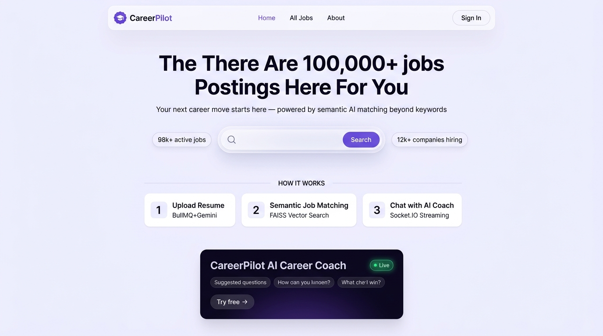
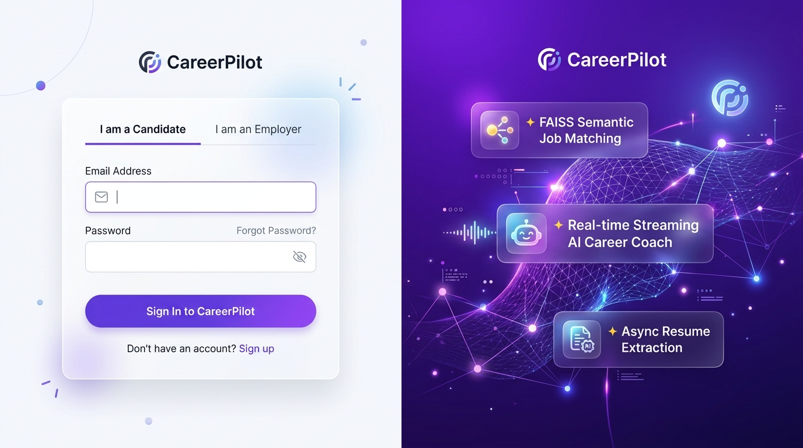
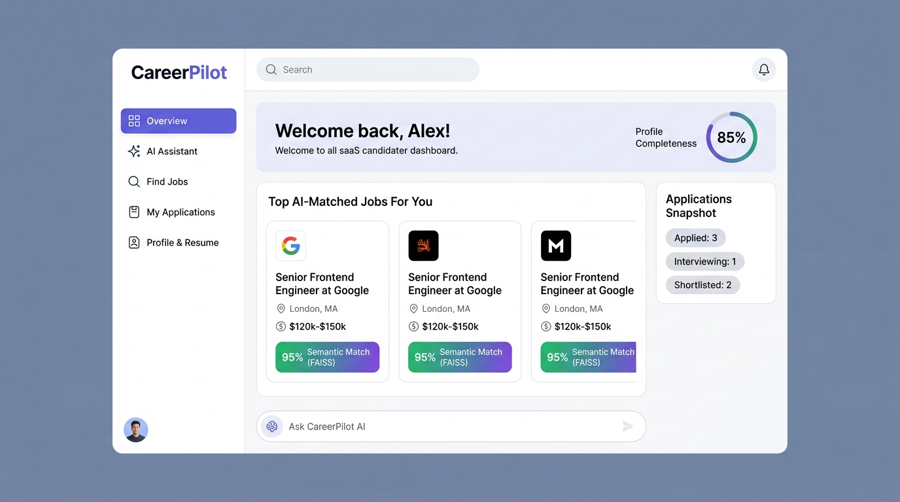
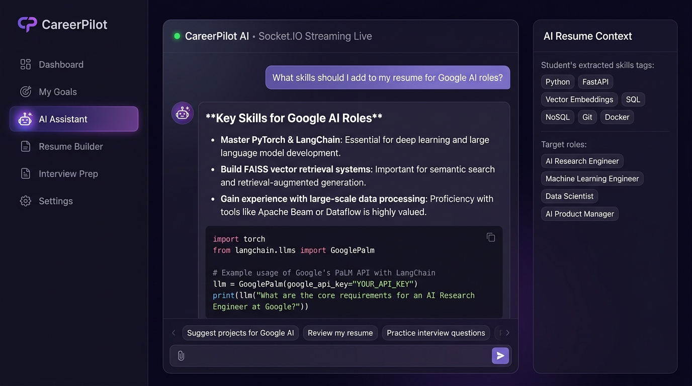
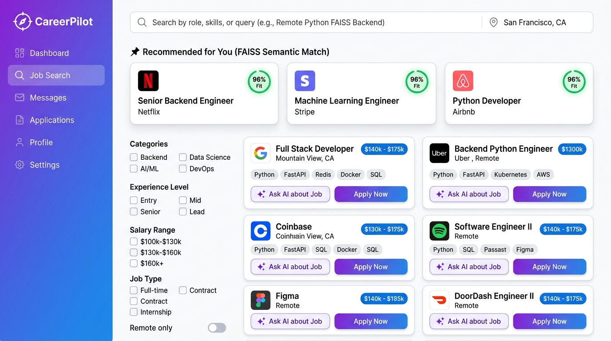
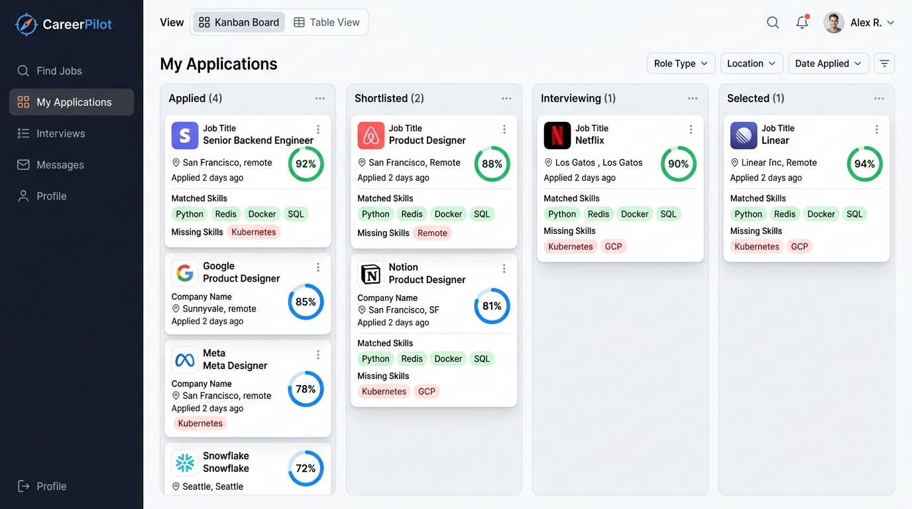
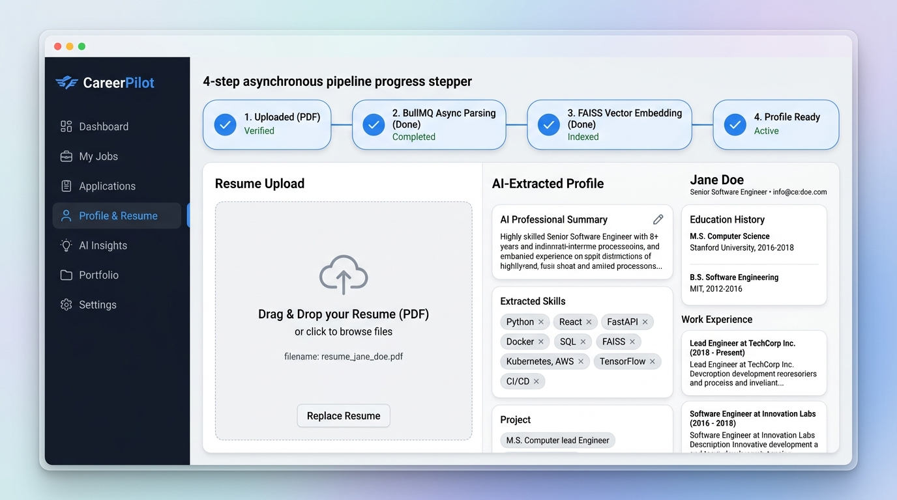
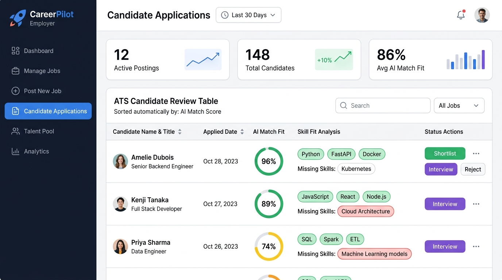

# CareerPilot — Frontend Redesign Specification & Visual Blueprint (`idea.md`)

> **Platform:** CareerPilot (AI-Powered Smart Recruitment & Internship Matching Platform)  
> **Reference Specs:** [`careerpilot-redesign-spec.md`](file:///d:/ai%20based%20intership%20recommendation/careerpilot-redesign-spec.md) & [`frontend.md`](file:///d:/ai%20based%20intership%20recommendation/AI-Based-Internship-Recommendation/frontend.md)  
> **Visual Assets:** Stored in [`photos/`](file:///d:/ai%20based%20intership%20recommendation/AI-Based-Internship-Recommendation/photos/)

---

## 1. Executive Concept & UI/UX Philosophy

The core vision of CareerPilot v2.0 is to elevate the platform from a "single marketing scroll with a chatbot widget" to a **dual-portal, industry-standard SaaS application** with distinct, dedicated workspaces for **Candidates (Students)** and **Recruiters (Employers)**.

### Core Architectural Shift:
1. **Public Marketing Portal (`/`, `/about`, `/terms`, `/jobs`):** Converts visitors into registered users with clean value propositions, live search previews, a 3-step "How It Works" pipeline, and a static teaser for the AI Career Coach.
2. **Candidate App Shell (`/app/**`):** Dedicated workspace after student login featuring a persistent left sidebar, profile completeness meter, top FAISS-matched jobs, ATS Kanban application board, and a full-page real-time Socket.IO streaming AI Career Coach.
3. **Recruiter Dashboard (`/dashboard/**`):** Enterprise ATS with AI candidate rankings, instant match score breakdowns, skill fit gap analysis, and one-click applicant workflow actions.

---

## 2. 🌟 Golden Design System & Universal Theme Benchmark (Screen 3 Reference)

> [!IMPORTANT]
> ### THEME UNIFICATION RULE: Screen 3 is the Single Source of Truth
> **Screen 3 ([`photos/candidate_dashboard.jpg`](file:///d:/ai%20based%20intership%20recommendation/AI-Based-Internship-Recommendation/photos/candidate_dashboard.jpg)) is the definitive visual theme benchmark for the entire application.**
>
> While Screens 4 through 8 showcase the specific **layouts, card structures, wireframes, and workflows** for each feature (AI Chat, Kanban board, Resume Stepper, Job Filters, and ATS Table), their **visual theme, color scheme, chrome, sidebar styling, and card aesthetics MUST strictly follow Screen 3**.
> 
> *Do not mix disparate sidebar backgrounds (e.g. blue gradients, dark navy sidebars) or inconsistent dark modes across pages. All authenticated screens share the exact same clean, modern, white/slate SaaS aesthetic established in Screen 3.*

```
Universal Theme Tokens (Standardized from Screen 3):
├── Primary Accent:       #6366F1 (Electric Indigo) & #7C3AED (Violet Accent)
├── Secondary Glow:       #8B5CF6 (Purple Focus / Active Rings)
├── Canvas Background:    #F8FAFC (Soft Slate White)
├── Sidebar Chrome:       #FFFFFF (Pure White) with border-r border-slate-200/80
├── Sidebar Active Item:  bg-indigo-600 text-white rounded-xl shadow-md shadow-indigo-100 (or bg-indigo-50 text-indigo-600 font-bold)
├── Top Header Chrome:    #FFFFFF/90 + backdrop-blur-md + border-b border-slate-200/80
├── Card Surfaces:        #FFFFFF (Pure White) + rounded-2xl + border border-slate-100/90 + shadow-sm hover:shadow-md
├── Typography:           "Outfit", -apple-system, sans-serif (Slate-900 Headings, Slate-500 Body)
└── Status Accents:       Applied (Slate), Shortlisted (Indigo), Interviewing (Amber), Selected (Emerald)
```

---

## 3. Visual Mockups & Detailed Page Specifications

---

### Screen 1: Public Landing & Discovery Portal (`/`)

> **Visual Asset:** [`photos/landing_page.jpg`](file:///d:/ai%20based%20intership%20recommendation/AI-Based-Internship-Recommendation/photos/landing_page.jpg)



#### Key UI Elements & Layout:
- **Floating Glass Navigation Bar:** CareerPilot purple badge logo, navigation links (`Home`, `All Jobs`, `About`), and `Sign In` / `Sign Up` buttons.
- **Hero Title & Value Statement:** *"There Are 100,000+ Postings Here For You"* with the *"✦ AI-Powered Job Matching — Now Live"* floating pill badge.
- **Pill-Shaped Glassmorphic Search Bar:**
  - Left Stat Chip: `98k+ Active Jobs`
  - Integrated Search Inputs: `Job title, skills, company...` + `Location or Remote` + Purple `Search` Action Button
  - Right Stat Chip: `12k+ Companies Hiring`
- **3-Step "How It Works" Pipeline Section:**
  1. **Upload Resume:** AI parses and builds your profile async via BullMQ + Gemini.
  2. **Semantic Job Matching:** FAISS vector search beyond keyword filtering.
  3. **Chat with AI Coach:** LangChain + Socket.IO token streaming, context-aware to your resume.
- **AI Career Coach Teaser Card:** Deep obsidian violet glassmorphic card with a pulsing green `● Live` indicator, suggested prompt chips (*"What jobs match my resume?"*, *"Find remote Python internships"*), and a `Try free →` CTA linking to `/candidate-login?next=/app/assistant`.

---

### Screen 2: Candidate & Recruiter Unified Auth Portal (`/candidate-login`, `/recruiter-login`)

> **Visual Asset:** [`photos/auth_portal.jpg`](file:///d:/ai%20based%20intership%20recommendation/AI-Based-Internship-Recommendation/photos/auth_portal.jpg)



#### Key UI Elements & Layout:
- **Split-Screen Layout:**
  - **Left Form Card:** Glassmorphic card with tab switcher (`I am a Candidate` / `I am an Employer`), email and password inputs with toggleable visibility, and a high-conversion purple gradient action button.
  - **Right Visual Panel:** Deep violet gradient with 3D neural mesh graphics and glowing floating badges highlighting platform capabilities:
    - `✦ FAISS Semantic Job Matching`
    - `✦ Real-time Streaming AI Career Coach`
    - `✦ Async Resume Extraction`
- **Post-Login Routing Logic:**
  - Candidates redirect automatically to `/app` (never back to `/`).
  - Recruiters redirect automatically to `/dashboard`.

---

### Screen 3: Candidate App Shell & Dashboard Overview (`/app`) — 🌟 GOLDEN THEME BENCHMARK

> **Visual Asset:** [`photos/candidate_dashboard.jpg`](file:///d:/ai%20based%20intership%20recommendation/AI-Based-Internship-Recommendation/photos/candidate_dashboard.jpg)



> [!TIP]
> **This screen establishes the exact theme, sidebar, topbar, and card styling for all subsequent candidate & recruiter pages.**

#### Key UI Elements & Layout:
- **Persistent App Sidebar (`AppLayout.jsx`):**
  - Brand logo at top, clean white background, soft border-right.
  - Links: `Overview` (active purple capsule), `AI Assistant`, `Find Jobs`, `My Applications`, `Profile & Resume`.
  - User avatar and quick profile settings at the bottom.
- **Top Welcome & Health Banner:**
  - *"Welcome back, Alex!"*
  - Interactive **Circular Profile Completeness Meter (85%)** with quick link to complete missing sections.
- **Top AI-Matched Jobs Rail:**
  - Highlights top 3 jobs ranked by FAISS vector similarity.
  - Prominent badge: `95% Semantic Match (FAISS)`.
- **Applications Snapshot Card:**
  - Quick count of active applications by status (`Applied: 3`, `Interviewing: 1`, `Shortlisted: 2`).
- **Quick AI Prompt Bar:**
  - Bottom input bar: *"Ask CareerPilot AI..."* — typing a question immediately routes to `/app/assistant` and starts token streaming.

---

### Screen 4: Full-Page AI Career Assistant (`/app/assistant`)

> **Visual Asset (Layout Reference):** [`photos/ai_assistant.jpg`](file:///d:/ai%20based%20intership%20recommendation/AI-Based-Internship-Recommendation/photos/ai_assistant.jpg)  
> **Theme Requirement:** Apply **Screen 3 white/slate app shell** around the chat workspace.



#### Key UI Elements & Layout:
- **Unified App Shell (from Screen 3):** Clean white sidebar on the left with `AI Assistant` highlighted in purple.
- **Dedicated Full-Page Chat Console:**
  - Fills the main viewport area inside `<AppLayout>` (no floating popup or small modal).
  - Live status badge: `● CareerPilot AI • Socket.IO Streaming Live`.
  - Token-by-token real-time streaming with typing cursor (`▋`).
  - Rich Markdown formatting: bullet points, bold headers, and syntax-highlighted code blocks.
- **Right-Hand Context Inspector Rail (Desktop):**
  - Displays the active resume context feeding the LangChain model:
    - Extracted Skills: `Python`, `FastAPI`, `Vector Embeddings`, `SQL`, `Docker`
    - Target Roles: `AI Research Engineer`, `Machine Learning Engineer`
- **Bottom Action Bar:** Quick suggestion chips (*"Suggest projects for Google AI"*, *"Review my resume"*, *"Practice interview questions"*) and prompt textarea.

---

### Screen 5: Semantic Job Discovery & Recommendations (`/app/jobs` & `/jobs`)

> **Visual Asset (Layout Reference):** [`photos/job_search.jpg`](file:///d:/ai%20based%20intership%20recommendation/AI-Based-Internship-Recommendation/photos/job_search.jpg)  
> **Theme Requirement:** Re-skin with **Screen 3 white sidebar & slate canvas** (discard the blue gradient sidebar from the image).



#### Key UI Elements & Layout:
- **Unified App Shell (from Screen 3):** Standard white sidebar with `Find Jobs` active.
- **Top Search Pill:** Input allowing natural language semantic queries (e.g., *"Remote Python FAISS Backend"*).
- **Pinned "Recommended for You" Rail:** Top carousel highlighting the highest-ranking FAISS matches with a glowing `96% Fit` badge.
- **Left Facet Filter Sidebar:** Categories, Experience Level, Salary Range, and a `Remote Only` toggle.
- **Elevated Job Cards (Screen 3 Card Styling):**
  - Company logo, job title, location, salary badge (`$140k - $175k`), and tech stack tags.
  - Primary Action: `Apply Now` (Purple gradient button).
  - Secondary Action: `✦ Ask AI about Job` (Opens AI assistant with job description preloaded as context).

---

### Screen 6: Candidate ATS Applications Tracker & Kanban (`/app/applications`)

> **Visual Asset (Layout Reference):** [`photos/applications_kanban.jpg`](file:///d:/ai%20based%20intership%20recommendation/AI-Based-Internship-Recommendation/photos/applications_kanban.jpg)  
> **Theme Requirement:** Embed inside **Screen 3 white sidebar & slate canvas**.



#### Key UI Elements & Layout:
- **Unified App Shell (from Screen 3):** Standard white sidebar with `My Applications` active.
- **View Mode Switcher:** Toggle between **Kanban Board** and **Table View**.
- **4 Kanban Pipeline Columns:**
  1. `Applied (4)`
  2. `Shortlisted (2)`
  3. `Interviewing (1)`
  4. `Selected (1)`
- **Detailed Candidate Application Cards:**
  - Company logo, role title, applied timestamp.
  - **Circular AI Match Fit Gauge:** Visual percentage score (`92%`, `88%`, `90%`, `94%`).
  - **Skill Fit Analysis:** Green tags for matched skills (`Python`, `Redis`, `Docker`), soft red tags for missing skill gaps (`Kubernetes`, `GCP`).

---

### Screen 7: AI Resume Profile & Extraction Pipeline (`/app/profile`)

> **Visual Asset (Layout Reference):** [`photos/resume_profile.jpg`](file:///d:/ai%20based%20intership%20recommendation/AI-Based-Internship-Recommendation/photos/resume_profile.jpg)  
> **Theme Requirement:** Embed inside **Screen 3 white sidebar & slate canvas**.



#### Key UI Elements & Layout:
- **Unified App Shell (from Screen 3):** Standard white sidebar with `Profile & Resume` active.
- **4-Step Asynchronous Pipeline Stepper:**
  - `1. Uploaded (PDF) ✓` → `2. BullMQ Async Parsing (Done) ✓` → `3. FAISS Vector Embedding (Done) ✓` → `4. Profile Ready ✓`
- **Two-Column Profile Workspace:**
  - **Left Dropzone:** Drag-and-drop PDF resume upload zone with file replace action.
  - **Right AI-Extracted Profile:**
    - `AI Professional Summary` with edit action.
    - `Extracted Skills` with interactive removable tags.
    - `Education History` cards.
    - `Work Experience` cards with timeline styling.

---

### Screen 8: Recruiter ATS Dashboard & AI Candidate Ranking (`/dashboard/view-applications`)

> **Visual Asset (Layout Reference):** [`photos/recruiter_dashboard.jpg`](file:///d:/ai%20based%20intership%20recommendation/AI-Based-Internship-Recommendation/photos/recruiter_dashboard.jpg)  
> **Theme Requirement:** Re-skin with **Screen 3 design tokens** for seamless platform consistency across student and employer portals.



#### Key UI Elements & Layout:
- **Unified App Shell (from Screen 3):** Consistent sidebar with Recruiter branding (`Manage Jobs`, `Post New Job`, `Candidate Applications`).
- **Top Metric Stat Cards:**
  - `12 Active Postings` (with trend graph)
  - `148 Total Candidates` (+10% this week)
  - `86% Avg AI Match Fit` (with distribution bars)
- **ATS Candidate Review Table:**
  - Automatically sorted descending by **AI Match Score**.
  - Candidate Avatar, Name, Title, and Date Applied.
  - **Circular AI Match Fit Gauge:** `96%`, `89%`, `74%`.
  - **Skill Fit Analysis:** Green pills for matched skills vs red pills for missing required skills.
  - **Status Workflow Actions:** `Shortlist` (green), `Interview` (purple), and `Reject` (gray/red).

---

## 4. Implementation Roadmap

```mermaid
graph LR
    P1[Phase 1: Shell & Routing (Screen 3 Base)] --> P2[Phase 2: Full-Page AI Assistant]
    P2 --> P3[Phase 3: Candidate Portal & Kanban]
    P3 --> P4[Phase 4: Job Discovery & Cards]
    P4 --> P5[Phase 5: Recruiter ATS Dashboard]
    P5 --> P6[Phase 6: Marketing Home Polish]
```

1. **Phase 1 (App Shell & Navigation based on Screen 3):** Implement `<AppLayout>` with the Screen 3 white/slate sidebar, topbar, and configure `/app/*` protected routes with `redirectAfterLogin`.
2. **Phase 2 (AI Career Assistant Migration):** Mount full-page streaming chat at `/app/assistant` inside the Screen 3 shell with right-hand resume context rail.
3. **Phase 3 (Candidate Portal & Kanban):** Implement `/app` Overview dashboard, `/app/profile` async pipeline stepper, and `/app/applications` Kanban ATS board.
4. **Phase 4 (Job Discovery):** Update `/app/jobs` with top FAISS recommended rail and "Ask AI about Job" button.
5. **Phase 5 (Recruiter ATS Modernization):** Restyle `/dashboard/**` with Screen 3 design tokens, Lucide icons, metric overview cards, and candidate match score gauges.
6. **Phase 6 (Public Landing Polish):** Update Home page with the 3-step "How It Works" strip, hero search routing, and static AI preview panel.
